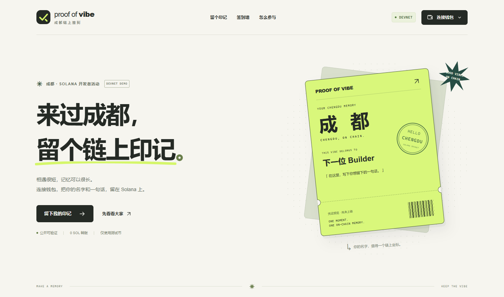

# Proof of Vibe · 成都链上签到

一个面向 Solana 成都活动的中文 Devnet demo：连接 Phantom，留下昵称和一句话，将签到记录写入 Solana，并在公开签到墙与区块浏览器中验证。

[在线 Demo（GitHub Pages 备用）](https://cxyt-coder.github.io/proof-of-vibe-chengdu/) · [GitHub 源码](https://github.com/CxyT-coder/proof-of-vibe-chengdu) · [最新 CI 成功记录](https://github.com/CxyT-coder/proof-of-vibe-chengdu/actions/runs/37586403285)



签到交易由 Memo 留言和带活动 reference 的 **0 SOL 自转**组成。用户支付测试网交易费，资金不会转给活动组织者。钱包自己保管密钥，网页通过 Wallet Standard 请求用户授权签名。

## Demo 做什么

- 未连接钱包也能读取公开的活动签到墙。
- 连接 Phantom，显示钱包地址和 Devnet SOL 余额。
- 填写昵称和留言，先模拟交易、查看摘要，再确认并打开钱包。
- 交易达到 `confirmed` 后显示签名和 Solana Explorer 链接。
- 用活动 reference 查询其他参与者的签到，无需在服务器保存名单。

Memo、钱包地址和交易记录公开可见。请使用练习钱包，并只填写愿意公开的内容。

## 从 Windows 启动

本机已有名为 Ubuntu 的 WSL2 发行版（Ubuntu 26.04）。开发脚本会自动定位项目在 WSL 中的路径；如项目中的 .tools/node-v24.14.1-linux-x64 存在，优先使用它，否则使用 Ubuntu 中已安装的 Linux Node.js 24+。

在项目目录打开 PowerShell：

```powershell
.\scripts\dev-wsl.ps1
```

打开终端显示的地址，默认是 [http://localhost:3000](http://localhost:3000)。保持终端运行；按 Ctrl+C 停止服务。

如果 Ubuntu 的发行版名称不同，或 3000 端口被占用：

```powershell
.\scripts\dev-wsl.ps1 -Distribution Ubuntu -Port 3001
```

脚本不安装依赖。首次拉取代码，需要在下面的 Ubuntu 步骤中先运行 npm ci；如果项目尚未生成锁文件，则运行 npm install。

## 从 Ubuntu、Linux 或 macOS 启动

要求 Node.js **24 或以上**。保留 package-lock.json 和模板已有依赖版本。

在本机 Ubuntu 中，进入项目并启用已下载的 Linux Node：

```bash
cd /mnt/c/Users/28153/Documents/ChatGPT/heikesong
export PATH="$PWD/.tools/node-v24.14.1-linux-x64/bin:$PATH"
node --version
npm --version
```

在安装了 Node.js 24+ 的其他机器上，从项目目录运行：

```bash
npm ci
npm run dev -- --hostname 0.0.0.0
```

开发服务器绑定 0.0.0.0，方便 Windows 浏览器访问 WSL 内的服务。钱包扩展在 **Windows 浏览器** 中操作，无需在 Ubuntu 里安装钱包。

## 钱包演示

1. 从 [Phantom 官方下载页](https://phantom.com/download)安装浏览器扩展，自己创建或选择练习钱包。
2. 在 Phantom 中打开测试网模式，选择 **Solana Devnet**。
3. 将钱包公开地址填入 [Solana Faucet](https://faucet.solana.com/)领取测试 SOL，等待余额到账。
4. 在网页连接 Phantom，填写公开昵称和留言。
5. 点击“模拟签到交易”，检查 Devnet、0 SOL 自转、留言和预计手续费。
6. 点击“确认并打开钱包”，自己检查钱包弹窗并确认。
7. 等待网页显示已确认，打开 Explorer 验证，再查看公开签到墙。

confirmed 表示交易已获得网络确认，区别于只生成签名或只广播请求；它不是最终不可逆状态 finalized。[Solana 确认级别](https://solana.com/docs/references/clusters)

助记词、私钥和钱包恢复文件不需要提供给本项目或 AI。页面模拟通过也不能替代用户在钱包弹窗中检查最终交易。

## 配置 RPC

默认使用公共 Devnet RPC。需要自己的 RPC 时，复制 .env.example 为 .env.local，填写 Devnet HTTP 和 WebSocket 地址，然后重启开发服务。

```dotenv
NEXT_PUBLIC_SOLANA_RPC_URL=https://api.devnet.solana.com
NEXT_PUBLIC_SOLANA_WS_URL=wss://api.devnet.solana.com
```

两条地址必须属于同一个 **Devnet** 网络。浏览器直接调用 RPC，HTTP 端点需要允许网站域名的 CORS，WebSocket 端点也需要允许对应来源。NEXT_PUBLIC_ 变量会进入前端代码；不要在这里填私钥、助记词或需要保密的 API 密钥。需要认证的 RPC 应配置仅供前端使用、受域名约束的凭据，或另建服务端代理。

## 验证与测试

源码已上传 GitHub。[最新 CI 运行](https://github.com/CxyT-coder/proof-of-vibe-chengdu/actions/runs/37586403285)已成功完成 Node.js 24 环境下的依赖安装、TypeScript 检查、自动测试与生产构建。[GitHub Pages 部署](https://github.com/CxyT-coder/proof-of-vibe-chengdu/actions/runs/37586402980)也已成功。

2026-10-07：本机 Ubuntu 生产页面和公开 demo 均已通过浏览器检查。公开页面的 Chrome 桌面与手机视口、钱包菜单、昵称与留言输入预览已验证；真实 Devnet RPC 返回 HTTP 200，页面错误与静态资源错误均为 0。

Windows 中运行 WSL 检查脚本：

```powershell
.\scripts\check-wsl.ps1
```

脚本依次执行生产构建、TypeScript 检查、自动测试。在 Ubuntu 中也可以分别运行：

```bash
npm run build
npm run typecheck
npm run test
npm run lint
npm run format:check
```

自动测试使用本地测试环境，不代表真实 Phantom 已完成授权或 Devnet 已完成一次签到。钱包连接、余额到账和公开交易链接需要实际演示确认。

## 提交与部署

- [活动准备清单](docs/PREPARATION.md)：按活动五项要求逐项核对。
- [60–90 秒演示稿](docs/DEMO_SCRIPT.md)：现场演示时可直接照着操作。
- [提交介绍](docs/SUBMISSION.md)：项目介绍、技术路线、公开 demo 和验证记录。

源码已发布至 [GitHub 仓库](https://github.com/CxyT-coder/proof-of-vibe-chengdu)。Vercel CLI 已安装，但官方登录页面提示无法完成登录，要求通过 [Account Recovery](https://vercel.com/accountrecovery)恢复账号。可复制的英文项目说明见 [准备清单](docs/PREPARATION.md)。

GitHub Pages 备用发布已完成：[打开在线 demo](https://cxyt-coder.github.io/proof-of-vibe-chengdu/)。Next.js 静态导出与 Actions 部署成功，公开页面已通过浏览器检查，可用于展示和提交项目链接。Vercel 账号恢复尚未完成。

Vercel 登录完成后导入仓库，使用 Next.js 框架、Node.js 24.x、npm run build 和默认输出设置。只有更换 RPC 时才需要添加上述两项环境变量。生产配置应继续使用 Devnet。[Vercel Next.js 部署说明](https://vercel.com/docs/frameworks/full-stack/nextjs)

后续也可将 Next.js 静态导出的 `out` 目录部署到 Cloudflare Pages，选择 `Next.js (Static HTML Export)` 预设，构建命令为 `npx next build`，设置构建环境变量 `STATIC_EXPORT=1`，并将 `NEXT_PUBLIC_BASE_PATH` 留空。配置与操作见 [Cloudflare 官方静态 Next.js 部署指南](https://developers.cloudflare.com/pages/framework-guides/nextjs/deploy-a-static-nextjs-site/)。钱包连接和 Devnet RPC 请求继续在浏览器中执行，仍需验证 RPC 对公开网站来源的访问权限。

本机的 .tools 运行时、node_modules、.env.local 与构建产物已列入忽略规则，不应上传到仓库。真实 Phantom 授权签名和 Devnet 签到交易仍需钱包持有人完成；活动提交入口按主办方要求填写。

## 技术与边界

来源为 [Solana 官方 Kit Next.js 模板](https://solana.com/developers/templates/nextjs)，模板源提交 aab62d27b01d44c6d2eba3c6da6d3bf038726ecc。当前项目沿用 Next.js 16.3.4、React 19.2.3、@solana/kit 7 系列和模板插件，使用 Tailwind CSS 4、TypeScript、Vitest 与 Surfpool。

reference 是只读、无需签名的活动标记，附加在 System Program 的 0 SOL 自转指令上。RPC 可通过 getSignaturesForAddress 找到包含该标记的交易，再读取并验证 Memo。这借用了 [Solana Pay reference 规范](https://docs.solanapay.com/spec#reference)中的索引方法。

公共签到墙最多读取最近 **20** 个相关交易候选，过滤有效的本活动签到。它不是完整历史名单；失败交易、无效格式或 RPC 暂不可用都会影响展示。活动 reference 公开可用，没有管理员控制、真人身份验证或严格的每人一次限制，不能作为正式门禁凭证。

公共 RPC 可能限流，Devnet 也不适合长期档案。活动 demo 优先展示完整的连接、模拟、签名、确认、验证流程。未来可增加活动管理、分页索引、内容审核，并用自定义合约限制重复签到或生成参与凭证。
